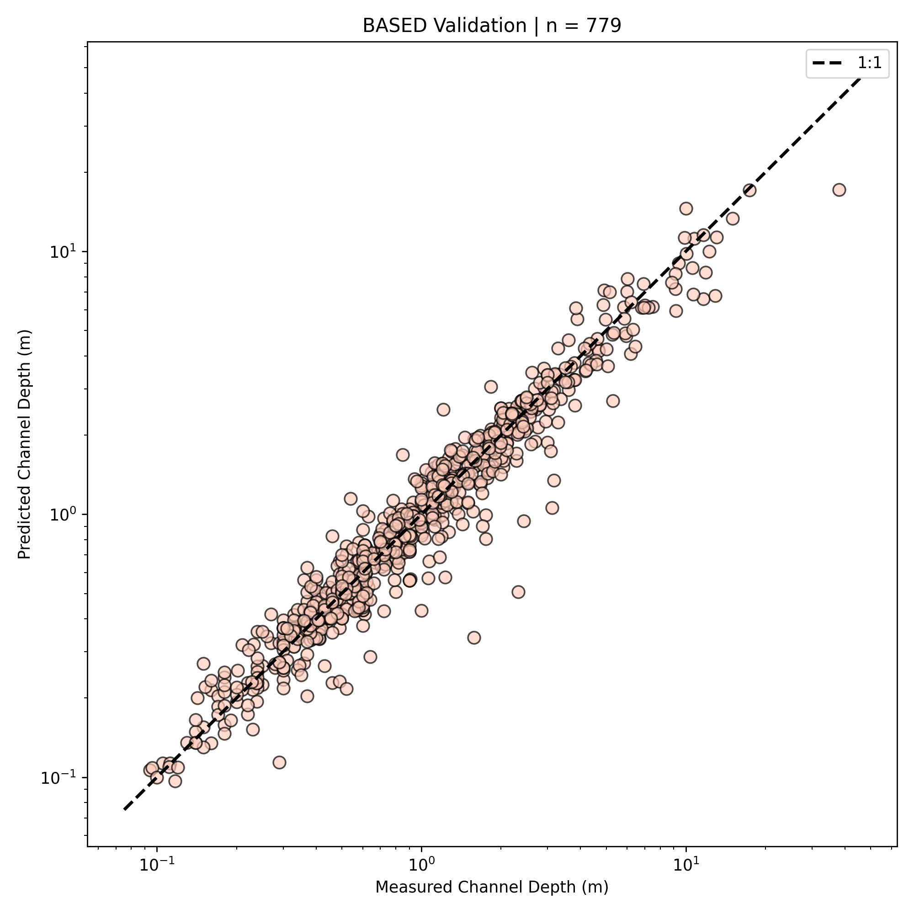

# BASED: Boost-Assisted Stream Estimator for Depth

[](https://www.python.org/downloads/)
[](https://opensource.org/licenses/MIT)

BASED is an XGBoost regressor deployed using Streamlit, designed for predicting channel depth using channel width, slope, and discharge.

## Features

- 🌊 Accurate channel depth predictions
- 🚀 Fast inference using XGBoost
- 🖥️ User-friendly Streamlit interface
- 📊 Built-in error benchmarks and validation

## Quick Start

1. Clone the repository:
   ```
   git clone https://github.com/JakeGearon/based-api.git
   cd based-api
   ```

2. Install dependencies:
   ```
   pip install poetry
   poetry install
   ```

3. Run the Streamlit app:
   ```
   poetry run streamlit run st_app.py
   ```

4. Input values for slope, discharge, and width to predict channel depth.

## Model Performance

- Mean Absolute Error (MAE): 0.24 cm
- Root Mean Square Error (RMSE): 0.55
- R-squared (R²): 0.97



## Citation

If you use BASED in your research, please cite it as follows:

```
Gearon, J. (2024). Boost-Assisted Stream Estimator for Depth (BASED) [Computer software]. Version 1.0.0. https://github.com/JakeGearon/based-api
```

## License

This project is licensed under the MIT License - see the [LICENSE](LICENSE) file for details.

## Contributing

Contributions are welcome! Please feel free to submit a Pull Request.

## Contact

Jake Gearon - jake.gearon@gmail.com

Project Link: [https://github.com/JakeGearon/based-api](https://github.com/JakeGearon/based-api)

## Setup

### Secrets Management

For local development:

1. Copy the secrets template:
   ```
   cp .streamlit/secrets.toml.template .streamlit/secrets.toml
   ```
2. Edit `.streamlit/secrets.toml` and replace the placeholder values with your actual secrets.

Note: Never commit `.streamlit/secrets.toml` to version control.

For production deployment, set up secrets according to your hosting platform's recommendations (e.g., Streamlit Cloud, Heroku, etc.).
