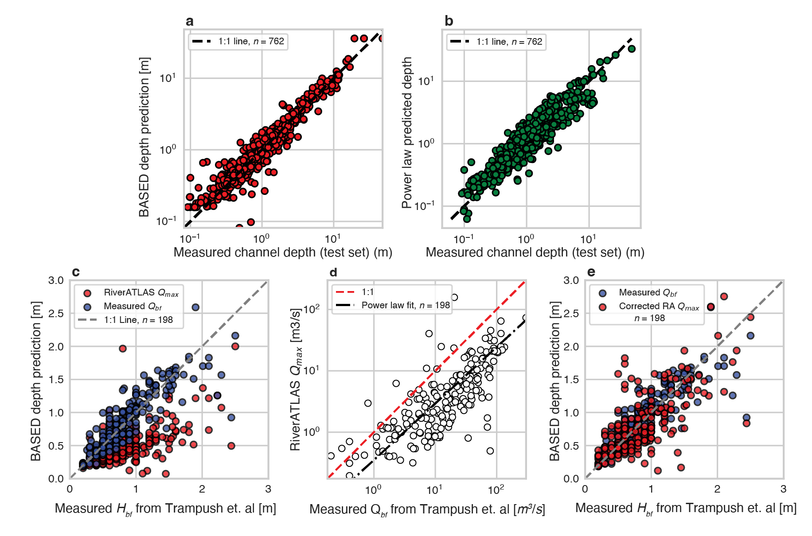

# 🌊 BASED: Boost-Assisted Stream Estimator for Depth

[](https://www.python.org/downloads/)
[](https://opensource.org/licenses/MIT)
[](https://www.nature.com/articles/s41586-024-07964-2)
[](https://based-estimator.streamlit.app/)

> 🚀 **Predict river depths instantly using machine learning!**

BASED is a revolutionary tool that predicts river channel depths using just three inputs: width, slope, and discharge. Published in Nature (2024), it combines cutting-edge machine learning with extensive river measurements to provide rapid, accurate depth estimates for researchers, engineers, and river scientists worldwide.

<p align="center">
  
</p>

## ✨ Why BASED?

- 🎯 **Highly Accurate**: 89% R² score on validation data
- ⚡ **Lightning Fast**: Get predictions in milliseconds
- 🌍 **Globally Applicable**: Trained on diverse river systems
- 📊 **Research Grade**: Published in Nature
- 🤝 **Community Driven**: Open source and actively maintained

## 🚀 Quick Start

```bash
# Clone the repo
git clone https://github.com/JakeGearon/based-api.git
cd based-api

# Install dependencies
pip install poetry
poetry install

# Launch the app
poetry run streamlit run st_app.py
```

## 📊 Model Performance

| Metric | Value | Description |
|--------|--------|------------|
| R² Score | 0.89 | Strong predictive power |
| MAE | 33 cm | Average error in meters |
| RMSE | 102 cm | Root mean square error |
| MAPE | 20% | Mean absolute percentage error |

## 💡 Use Cases

- **🏗️ River Engineering**: Design and assess river restoration projects
- **🌊 Hydraulic Modeling**: Quick depth estimates for model initialization
- **🔬 Research**: Support geomorphological studies
- **📏 Field Work**: Plan surveys and measurements

## 📚 Citation

```bibtex
@article{gearon2024rules,
  title={Rules of river avulsion change downstream},
  author={Gearon, J.H. and others},
  journal={Nature},
  volume={634},
  pages={91--95},
  year={2024},
  publisher={Nature Publishing Group}
}
```

## 🤝 Contributing

We love contributions! Here's how you can help:

- 🐛 Report bugs and issues
- 💡 Suggest new features
- 📝 Improve documentation
- 🔧 Submit pull requests

See our [Contributing Guidelines](CONTRIBUTING.md) for more details.

## 📬 Get in Touch

- 🌐 [Try the Live Demo](https://based-estimator.streamlit.app/)
- 📧 [Email Us](mailto:jake.gearon@gmail.com)
- 🐛 [Report Issues](https://github.com/JakeGearon/based-api/issues)
- 🌟 [Star us on GitHub](https://github.com/JakeGearon/based-api)

## 📄 License

MIT License - See [LICENSE](LICENSE) for details

---

<p align="center">
  Made with 💙 by the BASED team
</p>

